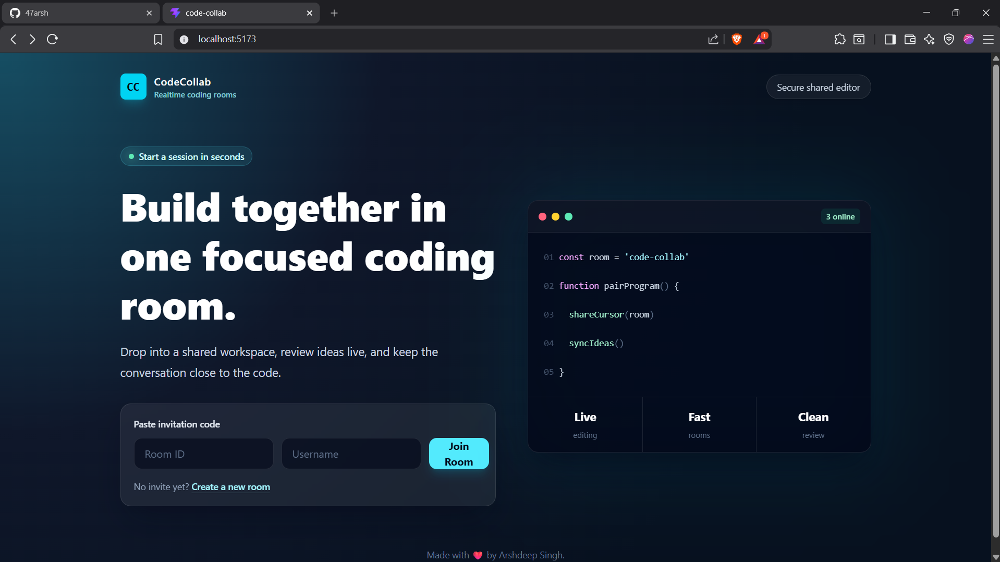
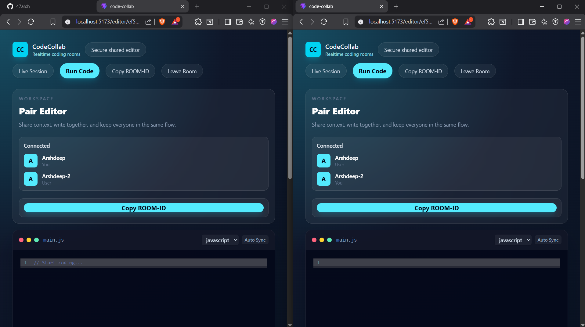
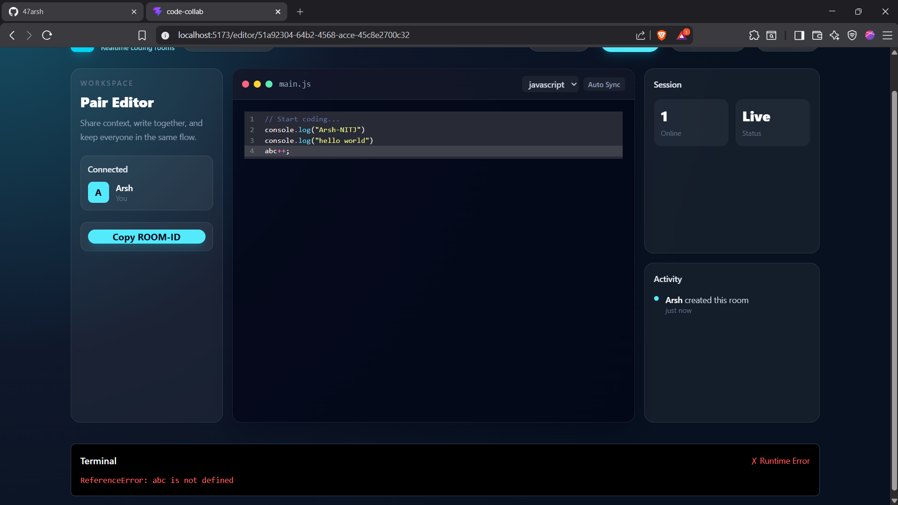

# CodeCollab - Realtime Collaborative Code Editor

A full-stack realtime collaborative code editor built using **React**, **Express**, **Socket.IO**, and **Yjs**.

The project demonstrates modern web application architecture, realtime communication, CRDT-based collaborative editing, CodeMirror integration, and backend-driven code execution.

It was built incrementally from first principles, with an emphasis on understanding the underlying concepts rather than simply reproducing tutorial code.

---

## 🌐 Live Demo

**Frontend:**
https://code-collab-chi-nine.vercel.app/

**Backend:**
https://codecollab-j5k7.onrender.com

> **Note:**
> The backend is hosted on Render's free tier and may take 30–60 seconds to wake up after periods of inactivity.

---

## 📸 Screenshots

### Home Page



---

### Collaborative Editor



---

### Run Code Terminal



---

## ✨ Features

### Realtime Collaboration

* Create unique coding rooms using UUIDs.
* Join existing rooms with a username.
* Room-based realtime communication using Socket.IO.
* CRDT-based collaborative document synchronization using Yjs.
* Conflict-resistant concurrent editing.
* Automatic synchronization of the shared document for newly connected participants.
* Dynamic "You" badge for the current user.
* Live online-user updates.
* Copy Room ID functionality.
* Leave room functionality with proper cleanup.

### Code Editor

* Built with CodeMirror.
* Integrated with Yjs through `y-codemirror.next`.
* Multiple language modes:

  * JavaScript
  * Python
  * Java
  * C++
* Automatic editor focus.
* Language switching support.

### Run Code

* Backend-powered code execution.
* Dedicated execution service abstraction.
* JavaScript execution using Node.js VM.
* Captures `console.log()` output.
* Runtime error handling.
* Infinite-loop timeout protection.
* Integrated terminal-style output panel.

### User Experience

* Toast notifications.
* Loading state while code executes.
* Live session indicator.
* Clean component-based architecture.

---

# 🏗️ Architecture

## Realtime Collaboration Architecture

The application uses **two different realtime responsibilities**:

### Socket.IO

Socket.IO is responsible for application-level realtime functionality such as:

* Room membership
* User join/leave events
* Online-user tracking
* Connection/disconnection handling

### Yjs

Yjs is responsible for the actual collaborative document.

The editor content is represented as a shared Yjs document rather than being broadcast as an entire string after every edit.

```text
                         Yjs Shared Document
                                │
                              Y.Text
                           /          \
                          /            \
                         ▼              ▼
                    User A            User B
                  CodeMirror        CodeMirror
                       ↕                ↕
                y-codemirror.next  y-codemirror.next
                       \                /
                        \              /
                         ▼            ▼
                         Yjs Realtime Sync
                                │
                         y-socket.io
                                │
                         Socket.IO Server
```

This allows concurrent changes to be merged through Yjs's CRDT-based synchronization model instead of relying on last-write-wins full-document replacement.

---

## Room / User Flow

```text
User
  │
  ▼
React Application
  │
  ▼
Socket.IO Client
  │
  ▼
Socket.IO Server
  │
  ├── Join Room
  ├── Track Users
  ├── Broadcast Membership Changes
  └── Handle Disconnects
```

The existing Socket.IO room system remains separate from the Yjs shared-document layer.

---

## Collaborative Editing Flow

```text
User types in CodeMirror
          │
          ▼
y-codemirror.next
          │
          ▼
       Y.Text
          │
          ▼
       Yjs Update
          │
          ▼
     y-socket.io
          │
          ▼
Other connected clients
          │
          ▼
       Y.Text
          │
          ▼
y-codemirror.next
          │
          ▼
     CodeMirror
```

Only the relevant Yjs update needs to be synchronized; the entire editor document does not need to be replaced on every keystroke.

---

## Why CRDT-based synchronization?

The original implementation synchronized the complete editor content through Socket.IO.

Conceptually, it worked like:

```text
User A
   │
CodeMirror
   │
Entire document
   │
Socket.IO
   │
Server
   │
Broadcast
   ▼
User B
```

This creates a problem when multiple users edit concurrently.

For example:

```text
Initial document:

Hello

User A → Hello A
User B → Hello B
```

If both users send their complete document state around the same time, one update can overwrite the other.

This behaves approximately like a **last-write-wins** synchronization strategy.

The Phase 1 architecture replaces that model with a shared Yjs document:

```text
CodeMirror
    ↕
  Y.Text
    ↕
  Yjs CRDT
    ↕
Realtime transport
    ↕
  Other replicas
```

Yjs allows concurrent changes to be merged so that connected replicas can eventually converge on the same document state.

---

# ▶️ Run Code Architecture

```text
User
 │
 │ Click Run
 ▼
React Frontend
 │
 │ POST /run
 ▼
Express Backend
 │
 ▼
executeCode() Service
 │
 ▼
Node.js VM Sandbox
 │
 ▼
Captured Output
 │
 ▼
Terminal UI
```

The frontend does not directly communicate with the execution engine.

Instead, the backend exposes a `/run` API and delegates execution to a dedicated service.

This keeps the execution implementation separate from the frontend and makes it possible to replace the execution engine later without changing the frontend API contract.

---

# 🛠️ Tech Stack

## Frontend

* React
* Vite
* Tailwind CSS
* React Router DOM
* CodeMirror
* Yjs
* y-codemirror.next
* Socket.IO Client
* Axios
* React Hot Toast
* UUID

## Backend

* Node.js
* Express.js
* Socket.IO
* y-socket.io
* CORS
* Node VM

---

# 📂 Project Structure

```text
CodeCollab/

├── client/
│   ├── src/
│   │   ├── components/
│   │   │   ├── Client.jsx
│   │   │   └── Editor.jsx
│   │   │
│   │   ├── pages/
│   │   │   ├── Home.jsx
│   │   │   └── EditorPage.jsx
│   │   │
│   │   ├── socket.js
│   │   ├── App.jsx
│   │   └── main.jsx
│   │
│   └── package.json
│
├── server/
│   ├── services/
│   │   └── executeCode.js
│   │
│   ├── server.js
│   └── package.json
│
└── README.md
```

---

# 🎯 Design Decisions

## Why Socket.IO?

The application requires low-latency bidirectional communication.

Socket.IO provides:

* Persistent realtime connections
* Room management
* Event-based communication
* Automatic reconnection handling
* Connection lifecycle events

However, Socket.IO is used primarily for **application-level realtime communication**.

It does not itself provide conflict resolution for collaborative text editing.

---

## Why Yjs?

Collaborative text editing requires more than simply transmitting messages between clients.

When two users modify the same document concurrently, the application needs a mechanism that can merge those changes consistently.

Yjs provides a **CRDT-based shared document model** that allows multiple replicas of a document to synchronize and converge despite concurrent updates.

The editor uses:

```text
CodeMirror
    ↕
y-codemirror.next
    ↕
Y.Text
    ↕
Y.Doc
```

This replaces the previous whole-document replacement approach.

---

## Why y-codemirror.next?

CodeMirror manages the editor UI and local text editing, while Yjs manages the shared collaborative document.

`y-codemirror.next` connects these two systems.

```text
CodeMirror
    ↕
y-codemirror.next
    ↕
Y.Text
```

This allows local editor changes to update the shared Yjs document and remote Yjs changes to update the editor.

---

## Why y-socket.io?

Yjs needs a realtime transport layer to exchange document updates between connected clients.

`y-socket.io` allows Yjs synchronization to operate over the existing Socket.IO infrastructure.

This lets the application retain Socket.IO for realtime communication while Yjs handles the actual shared-document synchronization and conflict resolution.

---

## Why a Singleton Socket Client?

A single shared socket instance prevents accidental multiple connections and simplifies lifecycle management across React components.

---

## Why is `codeRef` stored in the parent component?

The editor content is needed by multiple features, including code execution.

Keeping the relevant editor reference/state at the page level avoids unnecessary prop drilling and allows independent features to access the current editor state.

---

## Why use a backend `/run` endpoint?

Instead of:

```text
React
  │
  ▼
Execution Service
```

the project uses:

```text
React
  │
  │ POST /run
  ▼
Backend
  │
  ▼
Execution Service
```

This provides:

* Separation of concerns
* Provider abstraction
* A stable frontend API contract
* Easier future migration
* Better control over execution logic
* Cleaner frontend architecture

The frontend never depends directly on a third-party execution provider.

---

## Why Node VM instead of Judge0 or Piston?

The original design considered using an external execution service.

During development:

* The public Piston API became whitelist-only.
* Judge0 was evaluated as an alternative.
* RapidAPI billing requirements were intentionally avoided for a learning project.

Instead, execution logic was isolated behind:

```text
server/services/executeCode.js
```

This means the execution engine can be replaced later without changing the frontend or `/run` API contract.

The current implementation supports JavaScript execution through Node.js VM.

---

# ⚠️ Current Limitations

### Collaborative Editing

* CRDT-based synchronization is implemented using Yjs.
* The current implementation does not provide permanent database-backed document persistence.
* Yjs document state is not equivalent to long-term project storage.
* Horizontal scaling across multiple backend instances has not yet been implemented.
* Authentication and authorization are not implemented.
* Advanced collaborative features such as collaborative cursor positions are not currently implemented.

### Code Execution

* JavaScript execution only.
* Node.js VM is intended for development/educational purposes and should not be treated as a fully hardened production sandbox.
* Multi-language execution is not currently implemented.
* Resource isolation comparable to containerized judge systems is not currently implemented.

---

# 🚀 Future Improvements

## Collaboration

* Persistent room/document storage
* MongoDB or another persistent database
* Redis for distributed realtime infrastructure
* Horizontal backend scaling
* Authentication and authorization
* Collaborative cursor and selection indicators
* User presence improvements

## Code Editor

* File explorer
* Multiple files per room
* Project/workspace support
* Version history
* Save/restore sessions

## Code Execution

* Judge0 integration
* Self-hosted Piston
* Docker/container-based execution
* Multi-language execution
* Stronger CPU, memory, filesystem, and network isolation

## Product Features

* Shared terminal output
* Persistent projects
* User accounts
* Project permissions
* Deployment to scalable cloud infrastructure

---

# ⚙️ Installation

## Clone the repository

```bash
git clone <repository-url>
cd CodeCollab
```

## Install frontend dependencies

```bash
cd client
npm install
```

## Install backend dependencies

```bash
cd ../server
npm install
```

## Start backend

```bash
npm start
```

## Start frontend

Open another terminal:

```bash
cd client
npm run dev
```

---

# 📚 Learning Outcomes

This project was built primarily as a learning exercise to deeply understand:

* React component architecture
* State ownership
* Socket.IO event flow
* Express server architecture
* Backend service abstraction
* Realtime communication
* CRDT-based collaborative editing
* Yjs shared document architecture
* CodeMirror integration
* HTTP vs WebSocket communication patterns
* Concurrent editing and conflict resolution
* Backend-driven code execution
* Separation of concerns
* Client/server architecture

Rather than focusing solely on the final product, the goal was to understand **why each architectural decision was made and how larger collaborative applications are structured internally.**

---

# 📄 License

This project is intended for educational and portfolio purposes.
